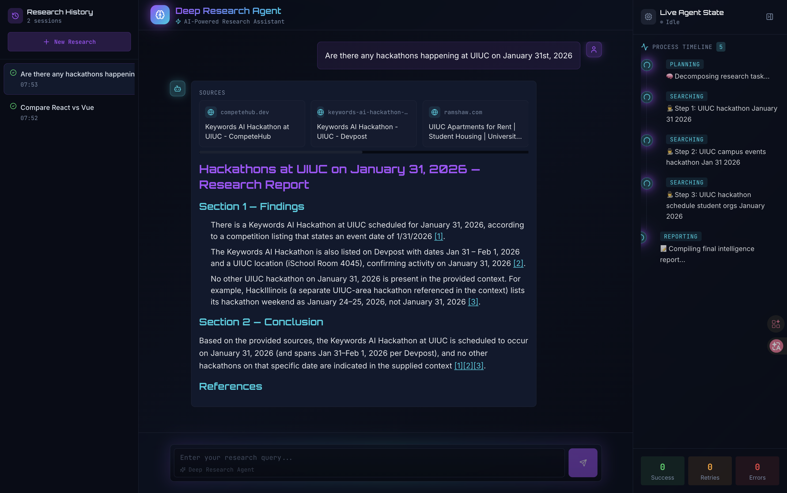
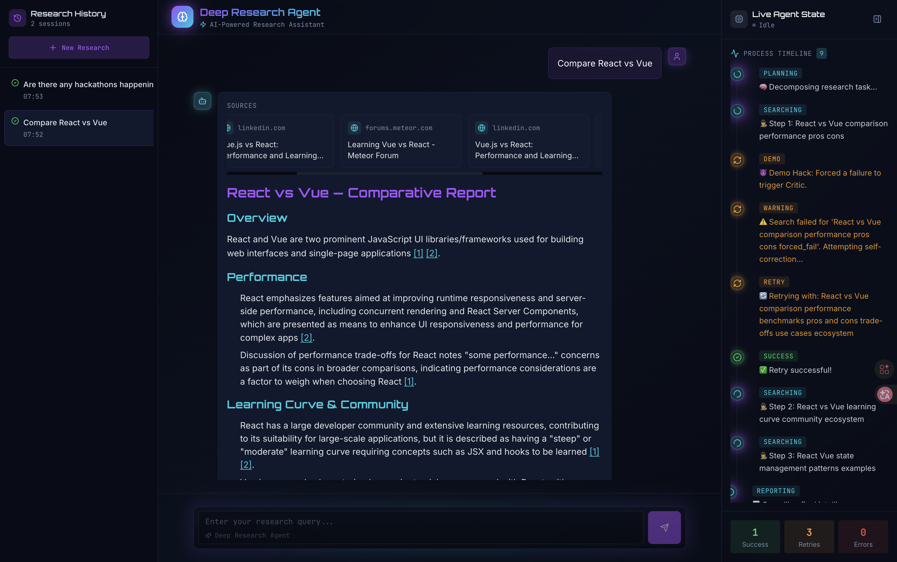
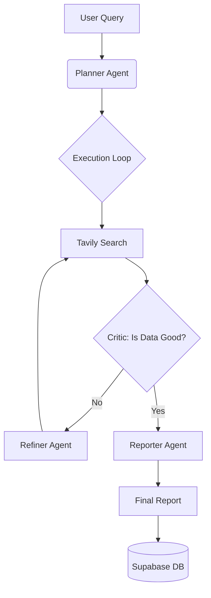

# 🧠 DeepSeeker: Self-Healing Deep Research Agent

> **Turn AI Hallucinations into Verified Intelligence.**
> Built for the Keywords AI UIUC Hackathon 2026.

[](https://keywords.ai/)
[](https://lovable.dev/)
[](https://tavily.com/)
[](https://supabase.com/)
[](https://www.trae.ai/)



## 🎥 Demo Video

**[🔗 Watch the 2-Minute Demo Here](https://www.youtube.com/watch?v=RQSeRDuB9W4)**
> *Note: The project is designed to run locally to ensure data privacy and optimal latency.*

---

## 💡 The Problem & Impact

Standard LLMs (like ChatGPT) are great at chatting but terrible at **Deep Research**. When asked about specific, recent, or obscure topics, they often hallucinate or rely on outdated training data.

**Who is this for?**
DeepSeeker is built for **Researchers, Developers, and Analysts** who cannot afford to be wrong. It bridges the gap between "Generative AI" and "Verifiable Truth."

---

## 🚀 The Solution: DeepSeeker

DeepSeeker is an **Agentic Research Engine** that doesn't just "guess"—it verifies. Unlike standard linear RAG chains, it uses a **Recursive "Plan → Search → Critic → Retry" Loop** to ensure high reliability.

### Key Features (AI Quality & UX)
* **🧠 Recursive Planning**: Dynamically breaks down complex user queries into actionable research steps (Managed via Keywords AI).
* **🔄 Self-Healing Critic (Novelty)**: The "Killer Feature". If a search yields low-quality data, the **Critic Agent** activates, rewrites the query, and retries automatically. It acts as an **AI Guardrail** against hallucinations.
* **📊 Live Agent State (UX Polish)**: Features a "DeepSeek R1-style" collapsible timeline (see screenshot) that visualizes the agent's thought process in real-time.
* **📝 Verified Reporting**: Generates academic-style Markdown reports with **clickable inline citations** grounded in real-time Tavily search data.
* **💾 Research Archive**: Automatically saves verified sessions to **Supabase** for persistence.

---

## 🛠️ Sponsor Tool Integration (Bonus Track)

### 1. Keywords AI (Core Infrastructure)
We used Keywords AI as the **Full-Stack Observability & Control Plane**:
* **Gateway**: Unified API access for all LLM calls.
* **Tracing**: Critical for debugging the "Retry Loop". We used traces to visualize the latency of the Critic Agent and optimize the flow.
* **Unified Prompt Management**: We decoupled the logic. The **Planner**, **Critic**, and **Reporter** agents are ALL managed via the dashboard, allowing us to iterate on prompts without redeploying code.

### 2. Lovable (Full-Stack UI)
* Built a polished, production-grade interface in React/Vite.
* We used Lovable to implement the complex **"Live Agent State"** visualization which tracks the backend WebSocket/API states in real-time.

### 3. Supabase (Database)
* Used as the persistent storage layer.
* We utilize **Supabase SQL** to store JSONB logs, allowing us to replay and analyze past research sessions.

### 4. Trae (AI IDE)
We utilized **Trae** as our intelligent development environment. Its AI coding assistance accelerated the build of our FastAPI backend and complex agentic logic, letting us focus on the recursive architecture instead of boilerplate code.

---

## 🏗️ Architecture (Technical Execution)

The system implements a **non-linear agentic loop** ensuring end-to-end reliability:



---

## 💻 How to Run Locally

### Prerequisites

* Python 3.9+
* Node.js & npm
* API Keys: Keywords AI, Tavily.

### 1. Backend Setup (The Brain)

```bash
cd backend
python -m venv venv
source venv/bin/activate  # Windows: venv\Scripts\activate
pip install -r requirements.txt

# Copy the example env and fill in your keys
cp .env.example .env

# Create .env file with your API keys
# KEYWORDS_AI_API_KEY=...
# PLANNER_PROMPT_ID=...
# CRITIC_PROMPT_ID=...

python server.py

```

*Server will start at `http://localhost:8000*`

### 2. Frontend Setup (The UI)

```bash
cd frontend
npm install
npm run dev

```

*UI will start at `http://localhost:8080` or `http://localhost:5173`*

### 3. Database Schema (Supabase)

Run this in your Supabase SQL Editor:

```sql
create table reports (
  id bigint generated by default as identity primary key,
  created_at timestamp with time zone default timezone('utc'::text, now()) not null,
  query text not null,
  markdown_content text not null,
  logs jsonb,
  sources jsonb
);
-- Note: Disable RLS for the demo.

```

---

## 🏆 Hackathon Tracks Targeted

* **Keywords AI**: Deep integration (Gateway, Traces, Prompt Mgmt).
* **Lovable**: High-quality UI with complex state visualization.
* **Technical Execution**: Fully working end-to-end product with self-healing capabilities.
